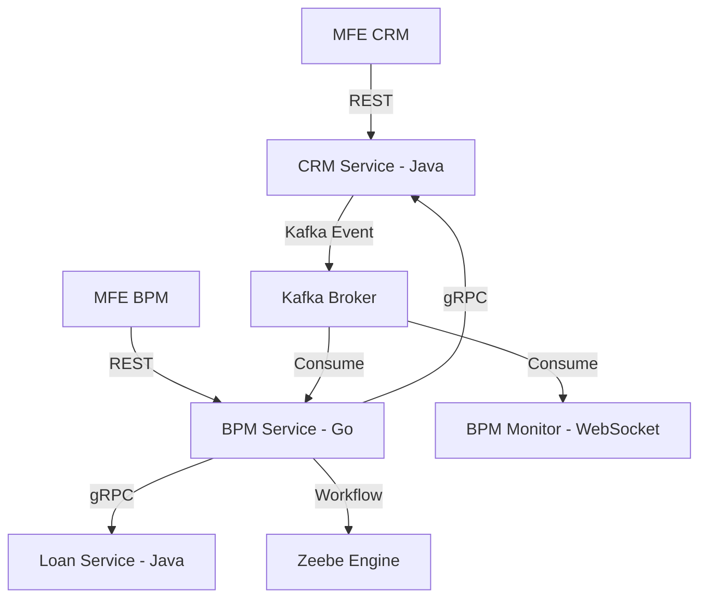

# Luồng Tích hợp Hệ thống (System Integration Flow)

Tài liệu này mô tả cách các module CRM, BPM, Khoản vay và Kafka phối hợp với nhau trong dự án Arda.

## 1. Kiến trúc Tổng quát (High-level)

## 2. Luồng nghiệp vụ: Khởi tạo Khách hàng (Register Customer)

1. **MFE CRM**: Người dùng hoàn thiện Stepper và bấm "Gửi duyệt".
   - Gọi API: `POST /api/v1/customers/register` sang **CRM Service (Java)**.
2. **CRM Service (Java)**:
   - Lưu dữ liệu hồ sơ tạm thời.
   - Phát sự kiện `CUSTOMER_REGISTRATION_CREATED` vào Kafka topic `crm-events`.
3. **BPM Service (Go)**:
   - `CRMEventConsumer` nhận sự kiện từ Kafka.
   - Khởi tạo instance quy trình `process_customer_registration` trong **Zeebe**.
4. **Hành động Người dùng (BPM MFE)**:
   - Cán bộ xử lý thấy task trong **Inbound Worklist**.
   - Thực hiện Phê duyệt/Từ chối qua **BPM Service (Go)**.
5. **Tự động hóa (Generic Worker)**:
   - Khi quy trình đến bước tự động (Service Task), **Generic Worker (Go)** sẽ:
     - Gọi gRPC `FinalizeCustomer` sang **CRM Service (Java)** để chính thức tạo khách hàng.
     - Phát sự kiện kết quả vào Kafka để cập nhật trạng thái Monitor.

## 3. Các giao thức giao tiếp

| Loại | Giao thức | Công nghệ | Ứng dụng |
| :--- | :--- | :--- | :--- |
| **User -> App** | REST | JSON / HTTP | Giao tiếp giữa MFEs và Backend services. |
| **Async Bus** | Event-Driven | Kafka | Kích hoạt luồng, thông báo trạng thái, Audit logs. |
| **Sync RPC** | Command | gRPC | BPM gọi các service chuyên biệt (CRM, Loan) để thực thi lệnh. |
| **Workflow** | Orchestration | Zeebe Protocol | Điều khiển luồng nghiệp vụ phức tạp. |
| **Real-time** | Stream | WebSocket / SSE | Cập nhật Monitor, Timeline sự kiện trên Frontend. |

## 4. Danh sách Topic Kafka

- `crm-events`: Đăng ký, thay đổi thông tin khách hàng.
- `loan-events`: Hồ sơ vay, giải ngân, trả nợ.
- `bpm-service-retry`: Topic xử lý lỗi tập trung (Error Hospital).
- `arda-audit`: Log vết tất cả hành động người dùng và hệ thống.
